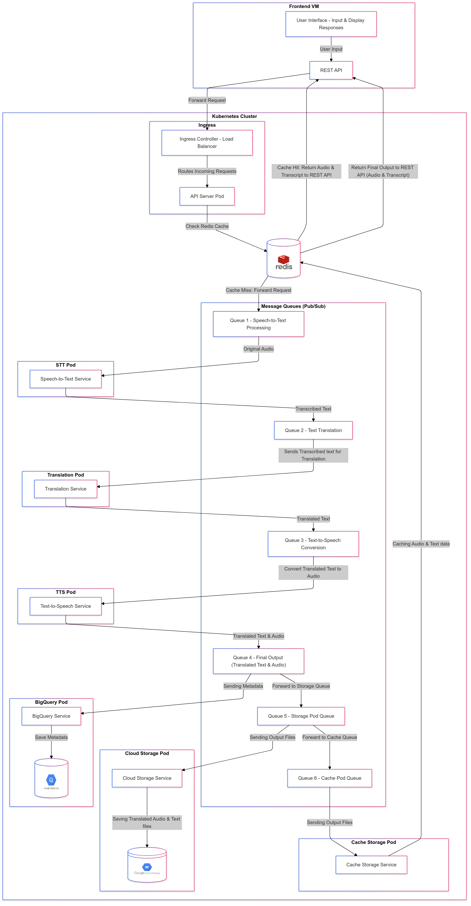

# **Multilingual Podcast Translation Service**

## **About the Project**
The Multilingual Podcast Translation Service empowers podcasters to break language barriers by seamlessly converting podcast audio into multiple languages. With automated speech-to-text, translation, and text-to-speech capabilities, this system ensures global accessibility, enabling podcasters to reach diverse audiences efficiently.


## **Project Team - 67** 
- **Saketh Reddy Dodda** - Led backend development, implemented microservices, and designed the system architecture including Kubernetes and ingress configurations.  
- **Navya Chalamalasetty** - Assisted with system architecture, integrated microservices into Kubernetes, and frontend development, auto-scaling and testing.


## **Key Features**
- **Time-Efficient:** Automates speech-to-text, translation, and text-to-speech workflows, significantly reducing manual effort.  
- **Enhanced Accessibility:** Enables content consumption across languages, promoting inclusivity for global audiences.  
- **Automated Translation Workflow:** Integrates Google APIs for accurate and reliable translations.  
- **Scalability:** Utilizes Kubernetes horizontal auto-scaling to handle varying workloads effectively.  
- **Seamless Integration and User Experience:** Features a user-friendly frontend interface connected to robust backend microservices.

## **Architecture**




## **Technologies Used**
- **REST API:**  Manages web application backends and handles HTTP requests.
- **Google APIs:** Google Cloud Speech-to-Text, Google Cloud Translation  
- **gTTS:** For converting text to speech  
- **Google Cloud Storage (GCS):** For file storage and retrieval  
- **Google Cloud BigQuery:** For metadata management and analytics  
- **Redis:** For caching results to improve response time  
- **Google Pub/Sub:** For managing message queues between microservices  
- **Google Kubernetes Engine (GKE):** For container orchestration  
- **Docker:** For containerized application deployment  


## **Prerequisites**
To deploy this project, ensure the following:  
- A **Google Cloud Platform (GCP)** account.  
- **Kubernetes** setup on GCP.   
- The **Google Cloud SDK** installed and configured, with access to `gcloud` and `kubectl` commands.


## **Installation**

### **Initial Setup**
To set up the environment, use the provided `script.sh` file. Below is a breakdown of its functionality:

1. **Set Project ID:** Associates resources with the specified GCP project.  
2. **Enable APIs:** Activates essential Google Cloud APIs, such as Compute Engine, Kubernetes Engine, and BigQuery.  
3. **Create a Service Account:** Sets up a service account with required permissions.  
4. **Assign Roles:** Grants the service account necessary roles for accessing and managing resources.  
5. **Generate a Key:** Creates a JSON key file for service account authentication.  
6. **Export Credentials:** Configures the environment to use the service account key.  
7. **Create Kubernetes Cluster:** Sets up a scalable Kubernetes cluster for microservices deployment.  
8. **Store Cluster Credentials:** Authenticates `kubectl` with the cluster.  
9. **Authenticate Docker with GCR:** Configures Docker to push container images to Google Container Registry (GCR).

### **Using the Script**
1. Make the script executable:  
   ```bash
   chmod +x script.sh
   ```
2. Run the script:  
   ```bash
   ./script.sh
   ```

### **Modifications**
- **Project ID:** Replace `'speech-translation-443516'` with your actual Google Cloud project ID in the script.  
- **Service Account and Roles:** Ensure the roles and permissions align with your project's security requirements.  
- **Cluster Configuration:** Modify the Kubernetes cluster setup parameters according to your specific needs, such as changing the machine type or the number of nodes.

---

## **Service Setup**
Each service in the project resides in its own folder, containing detailed README files for setup instructions. Refer to these READMEs for specifics:  
1. **REST API Service**  
2. **Speech-to-Text (STT) Service**  
3. **Translation Service**  
4. **Text-to-Speech (TTS) Service**  
5. **Database (BigQuery) Service**  
6. **Storage Service**  
7. **Redis Cache Service**  
8. **Frontend Service**  


## **Usage**
Access the frontend via the deployed virtual machine's IP address. Upload podcast audio files, specify source and target languages, and receive translated audio and text output.


## **Contact**
For inquiries or support:  
- **Saketh Reddy Dodda:** saketh.dodda@colorado.edu  
- **Navya Chalamalasetty:** navya.chalamalasetty@colorado.edu  


## **Acknowledgements**
- **Google APIs** 
- **Google Cloud Platform**

## **Conclusion**
This project demonstrates a scalable, automated system for translating podcasts into multiple languages, bridging communication gaps and enabling global accessibility.

